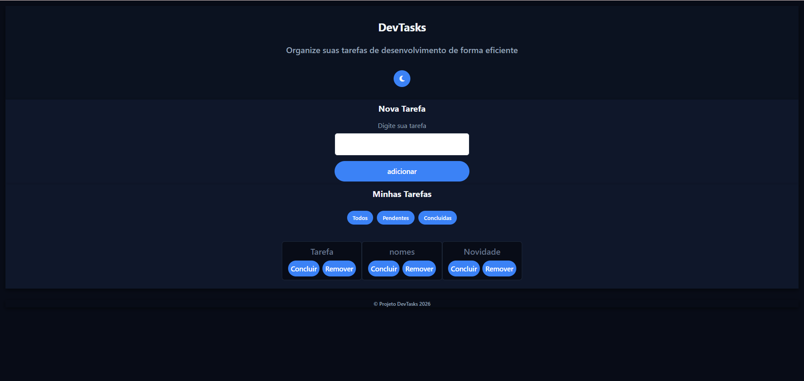
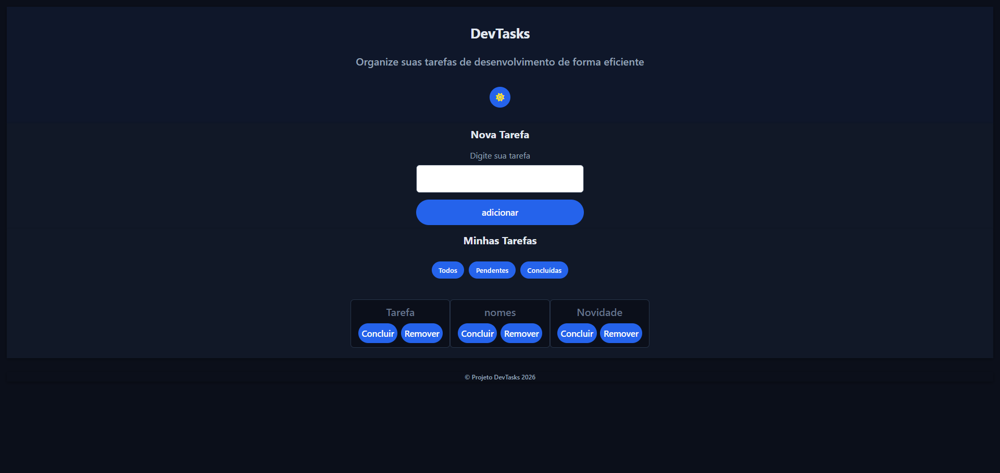

# 🚀 DevTasks — Gerenciador de Tarefas Moderno

<div align="center">

## ✨ Organize suas tarefas com praticidade e estilo

Aplicação web desenvolvida com **HTML, CSS e JavaScript Vanilla**, focada em boas práticas de desenvolvimento front-end, manipulação de DOM, persistência de dados e experiência do usuário.


</div>

---

# 📌 Sobre o Projeto

O **DevTasks** é uma aplicação de gerenciamento de tarefas criada para praticar conceitos fundamentais do desenvolvimento web moderno sem o uso de frameworks.

O projeto foi desenvolvido com foco em:

- Estruturação limpa de código
- Organização modular em JavaScript
- Manipulação eficiente do DOM
- Persistência de dados com localStorage
- Experiência do usuário (UX)
- Tema Dark/Light
- Validações robustas
- Arquitetura simples e escalável

---

# 🎯 Objetivos do Projeto

Este projeto teve como objetivo aprofundar conhecimentos em:

- JavaScript puro (Vanilla JS)
- Eventos e manipulação do DOM
- Persistência de dados no navegador
- Organização de código em serviços
- Boas práticas de UI/UX
- Responsividade
- Validação de formulários
- Programação orientada à organização modular

---

# 🖥️ Preview

## 🌙 Tema Dark


## ☀️ Tema Light


---

# ⚙️ Funcionalidades

## ✅ Gerenciamento de tarefas

- Adicionar tarefas
- Remover tarefas
- Marcar tarefas como concluídas
- Alternar status entre pendente/concluída

## 🔎 Sistema de filtros

- Todas as tarefas
- Pendentes
- Concluídas

## 🎨 Personalização

- Alternância entre tema dark/light
- Interface moderna e intuitiva

## 💾 Persistência de dados

As tarefas permanecem salvas mesmo após atualizar ou fechar o navegador utilizando:

- localStorage API

## 🛡️ Validações

- Mínimo de 3 caracteres
- Máximo de 200 caracteres
- Bloqueio de tarefas duplicadas
- Validação nativa HTML5 com `setCustomValidity`

---

# 🧠 Conceitos Aplicados

## 📦 Organização Modular

O projeto foi estruturado utilizando objetos como namespaces:

```javascript
const Storage = {};
const TarefasService = {};
const UI = {};
```

Essa abordagem melhora:

- Escalabilidade
- Legibilidade
- Manutenção do código

---

## ⚡ Event Delegation

Utilização de **event delegation** para lidar com elementos dinâmicos da lista de tarefas:

```javascript
listaTarefas.addEventListener("click", (event) => {
  // tratamento dos botões
});
```

Benefícios:

- Melhor performance
- Menos listeners
- Código mais limpo

---

## 💾 Persistência com localStorage

```javascript
localStorage.setItem("tarefas", JSON.stringify(tarefas));
```

Permite manter os dados do usuário salvos localmente.

---

# 🏗️ Estrutura do Projeto

```bash
dev-tasks/
│
├── index.html
├── style.css
├── index.js
└── assets/
```

---

# 🧩 Arquitetura da Aplicação

## 📁 Storage

Responsável por:

- Salvar tarefas
- Carregar tarefas
- Comunicação com localStorage

---

## 📁 TarefasService

Responsável pela lógica de negócio:

- Criar tarefas
- Alterar status
- Remover tarefas
- Filtrar tarefas

---

## 📁 UI

Responsável pela interface:

- Renderização das tarefas
- Manipulação visual
- Alteração de tema
- Atualização dinâmica da tela

---

# 🚀 Tecnologias Utilizadas

- HTML5
- CSS3
- JavaScript ES6+
- Font Awesome
- localStorage API

---

# 📱 Responsividade

O projeto foi desenvolvido pensando em diferentes tamanhos de tela:

- Desktop
- Tablet
- Mobile

---

# 💡 Diferenciais do Projeto

✨ Código organizado e escalável  
✨ Separação de responsabilidades  
✨ Interface moderna  
✨ Persistência de dados  
✨ Dark Mode  
✨ Validações avançadas  
✨ Sem uso de frameworks  
✨ Foco em boas práticas Front-End

---

# 📚 Aprendizados

Durante o desenvolvimento deste projeto, foram praticados conceitos importantes como:

- Manipulação avançada do DOM
- Estruturação de aplicações JavaScript
- Organização de responsabilidades
- Criação de interfaces reativas sem frameworks
- Experiência do usuário
- Persistência local de dados

---

# 🔥 Possíveis Melhorias Futuras

- [ ] Drag and Drop
- [ ] Categorias de tarefas
- [ ] Datas e prazos
- [ ] Sistema de prioridades
- [ ] Integração com API
- [ ] Autenticação de usuários
- [ ] Backend completo
- [ ] Notificações
- [ ] Animações avançadas

---

# 👩‍💻 Desenvolvedora

## Aline Seravali

Desenvolvedora Front-End em evolução constante, criando projetos práticos focados em experiência do usuário, organização de código e desenvolvimento moderno com JavaScript.

---

# 🔗 Links do Projeto

## 📂 Repositório
https://github.com/devseravali/dev-tasks

## 👩‍💻 Perfil GitHub
https://github.com/devseravali

---

# ⭐ Como Executar o Projeto

```bash
# Clone o repositório
git clone https://github.com/devseravali/dev-tasks.git

# Acesse a pasta
cd dev-tasks

# Abra o index.html no navegador
```

---

# 📄 Licença

Este projeto está sob a licença MIT.

---

<div align="center">

## ⭐ Se gostou do projeto, deixe uma estrela no repositório!

</div>